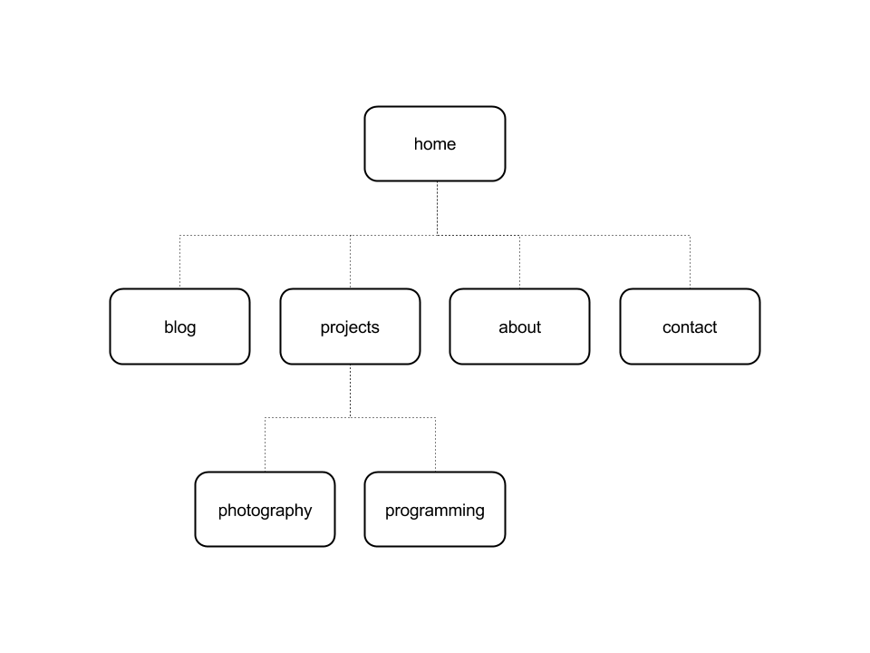

#2.3 Introduction to Design and Site Planning

* What are the 6 Phases of Web Design?
* What is your site's primary goal or purpose? What kind of content will your site feature?
* What is your target audience's interests and how do you see your site addressing them?
* What is the primary "action" the user should take when coming to your site? Do you want them to search for information, contact you, or see your portfolio? It's ok to have several actions at once, or different actions for different kinds of visitors.
* What are the main things someone should know about design and user experience?
* What is user experience design and why is it valuable? 
* Which parts of the challenge did you find tedious?

The 6 phases of design are:
1. Information Gathering
	At this initial step certain things are considered when starting the project. This includes, the purpose of the website (will it sell a product or a service? will it provide information?), the goal (to get more clients, to increase sales?), the target audience (is it teenagers? adults? adults with kids?), and finally, content (will there be articles? blog posts?).
2. Planning
	Once the information has been gathered the outline of the website is created. How many pages will it have? Will there be comment boxes? forms? At this point a visual site map can aid in the planning.
3. Design
	While keeping the target audience in mind, the look and the function of the website is created. It's possible at this point to have several mockups to compare and contrast different possible looks.
4. Development
	This is the creation phase. At this point the functionality of the website is put in place. Things such as a shopping cart, or forms, are constructed with the design of the site.
5. Testing and Delivery
	At this phase the final touches are made, the site is made public for purposes of testing the remaining bits of functionality. Other features such as SEO (search engine optimization) are put in place.
6. Maintenance
	Finally, maintance happens after the website is up and running. This means content is updated (if it's a blog), regular upkeep of complex systems, such as shopping carts, is done. This ensures the site remains in working condition and is always up to date.

My site's primary goal is to provide people with information about the things that I'm interested in. The goal is to acquire a community base of like minded followers and readers. The content will be things like how-to videos, written tutorials, reviews on products, etc.

My target audience is people who crave knowledge and have a different take on acquiring it. My site will address their interest by providing a very interactive site with tutorials, videos, and resouces to keep interested.

The site will be multifaceted. Some of the primary actions will be "view" content such as videos or gallery of my current work, but also they should be able to "search" for information easily on the site.

The main things to know about design and user experience is that, while traditionally speaking, design focuses on how the site looks and how it displays information, just in the last few years, the advances in website technology have enabled designers to incorporate the user experience (what a user feels, sees, reacts) into the design.

User experience design, sometimes abbreviated as UX design or UXD, is this idea that the functionality of a website should appeal to the different senses of a user. While traditional design ideas focused on what "looked good", UXD focuses on the needs of a person using the site. This means, that information and visual elements, such as tabs or forms, are enhaced and made easily accessible (or "user friendly") specifically with a target audience in mind. This mindset of user-first has really shifted the expectations of current users when it comes accessing websites. A high level of usability is expected as the uses for websites continue to grow.

The most tedious part of this challenge, for me, was trying to come up with a meaningful purpose for my site. I understand this is just the starting steps, but I just can't wait to see how my site evolves.

