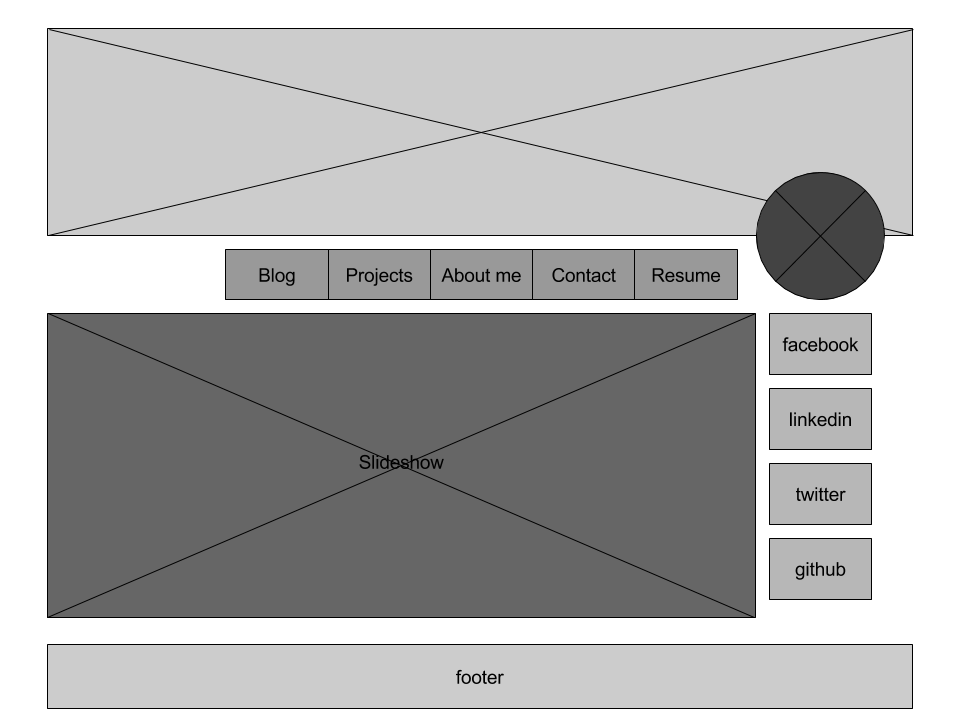
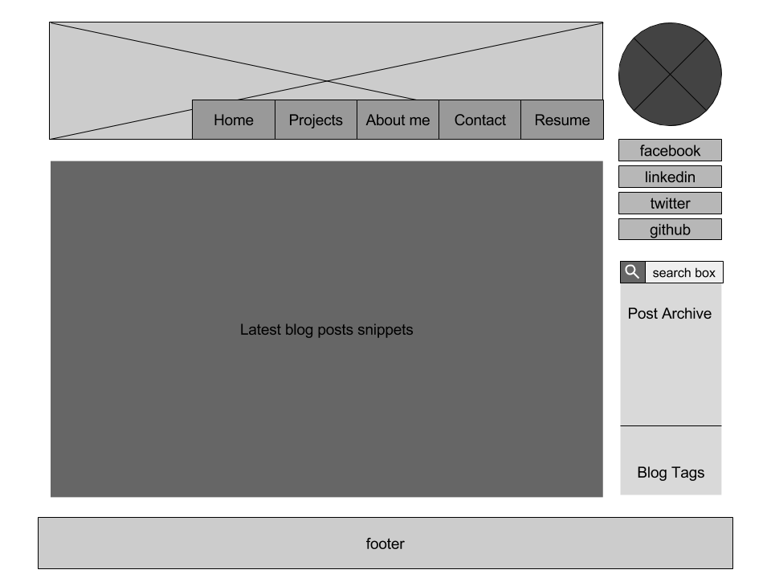

# 2.4 Wireframing

* What is a wireframe?
* What are the benefits of wireframing?
* Did you enjoy wireframing your site?
* Did you revise your wireframe or stick with your first idea?
* What questions did you ask during this challenge? What resources did you find to help you answer them?
* Which parts of the challenge did you enjoy and which parts did you find tedious?

A wireframe is a rough sketch of the look of a website. Specifically it acts like a skeleton, only showing placeholders for the different elements of the site. It differs from a mockup, in that it doesn't contain the full color scheme and potential final look of the site, again colors are only used as symbols and guides for the different parts of the site. It is also very different from a prototype because it doesn't contain any of the complex systems or functionality of a site, it is merely a drawing.

Simplicity is one of the major benefits of a wireframe. It allows designers to design a website without the potential distraction and confusion of color schemes. Furthermore, without the distractions, designers can focus on the user experience of the website, potentially showing the initial flaws or successes of a design. It also helps with the developing portion, as well, since it helps sustain a clear view of the individual parts that will go into a site (the comment box, shopping cart, etc.).

Initially, I was a bit overwhelmed with how to start a wireframe, however, once I placed some elements is definitely sparked my interest. I ended up having fun with moving around the different elements and resizing everything without worrying about how it looked. I was also surprised how slowly things stuck and became more pleasing to the eye.

I had a question regarding starting dimensions for a project. It does depend on the purpose and where the site would be viewed, but I ended up opting for a simple 4:3 ratio to begin. 

In the end I definitely enjoyed messing around with the different wireframing tools. There was no tediousness to speak up from the project itself, but after finally deciding on using Google Drawings, it was a bit frustrating getting used to the controls.

## Wireframe for index.html

## Wireframe for blog/index.html

