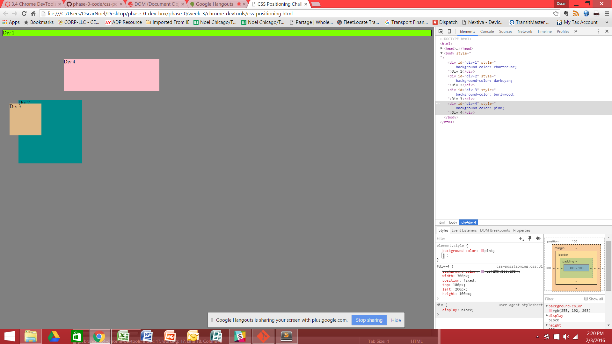
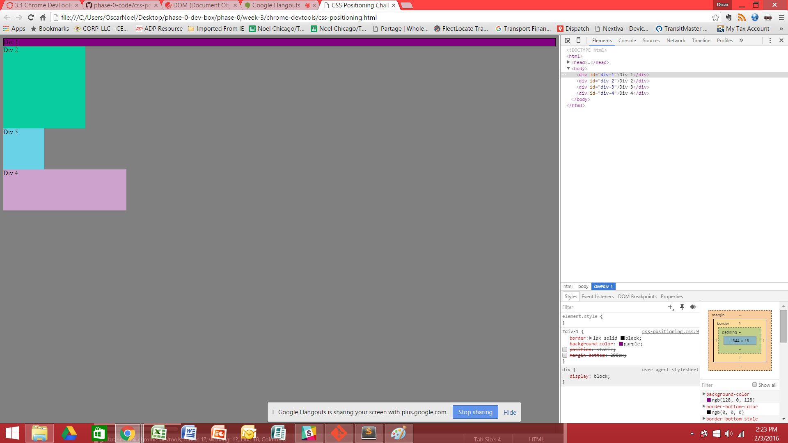
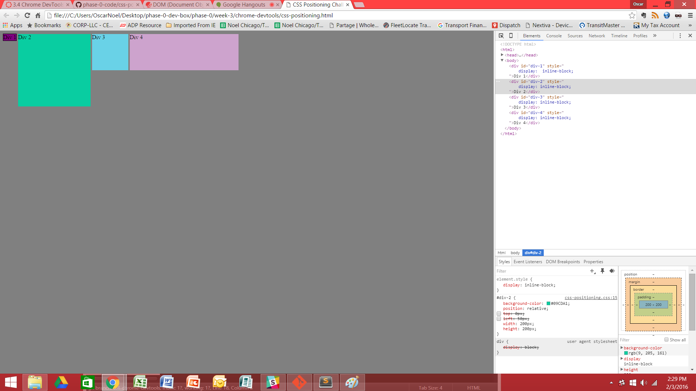
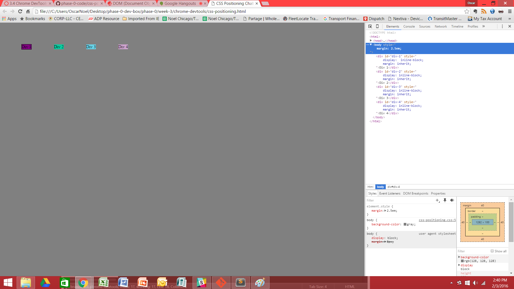
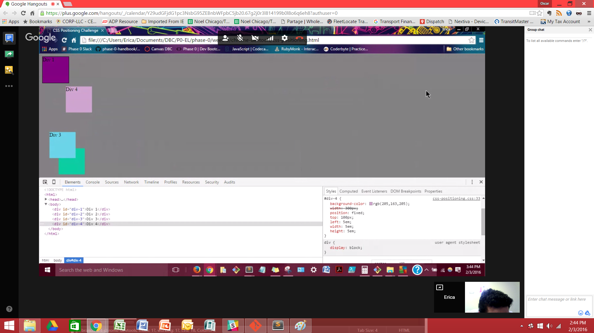
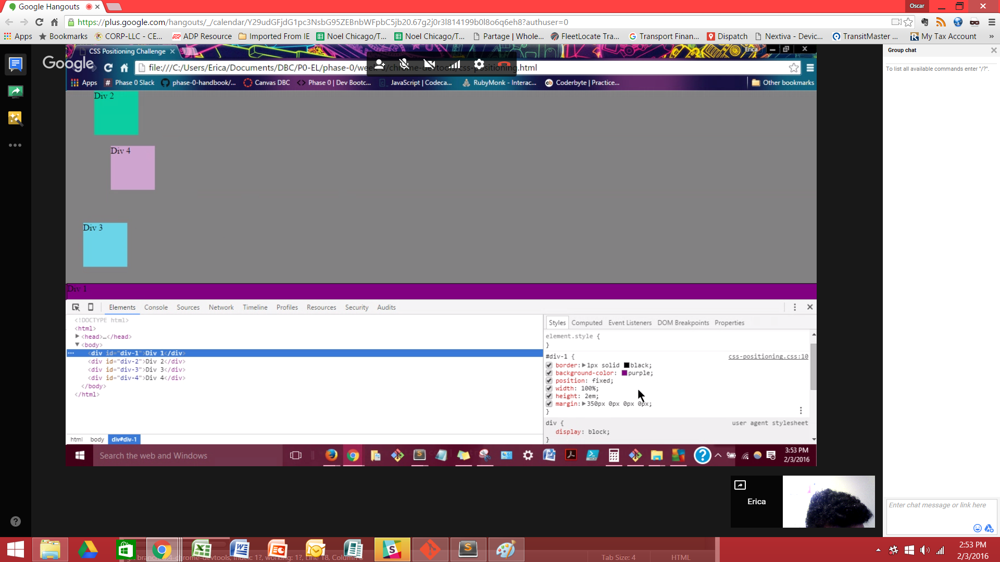
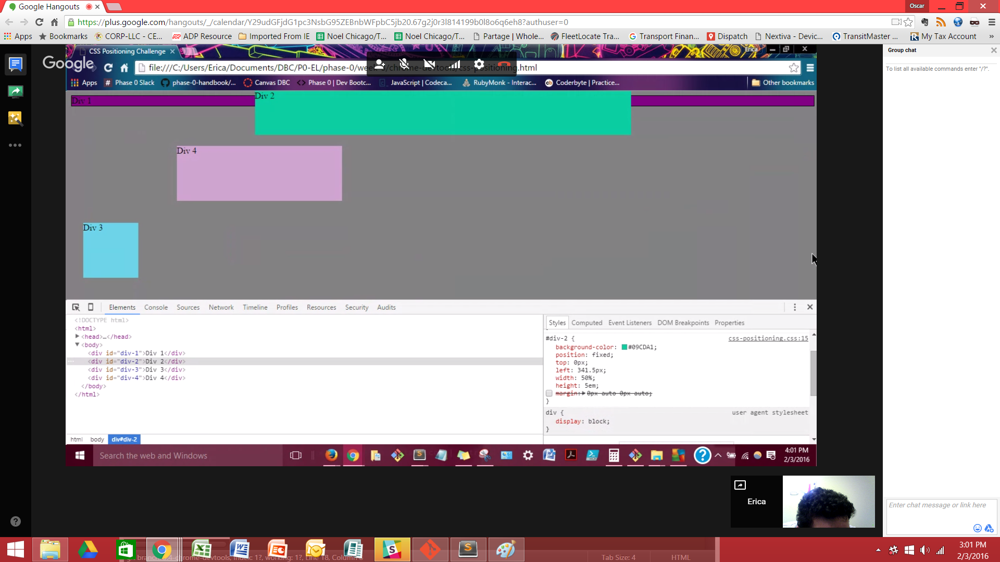
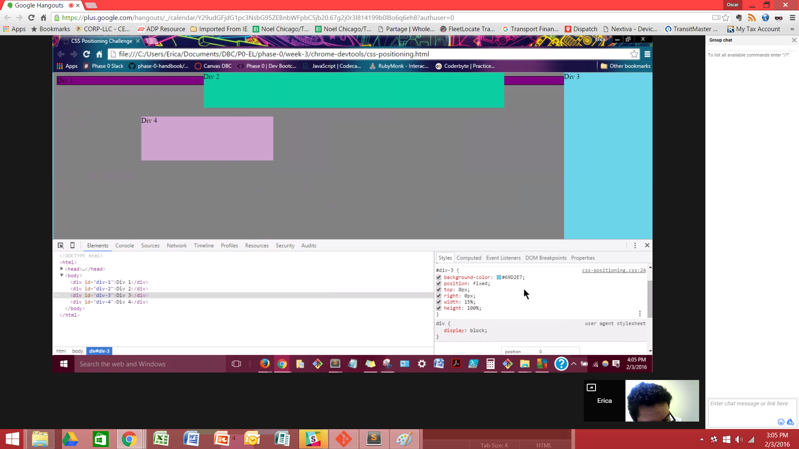
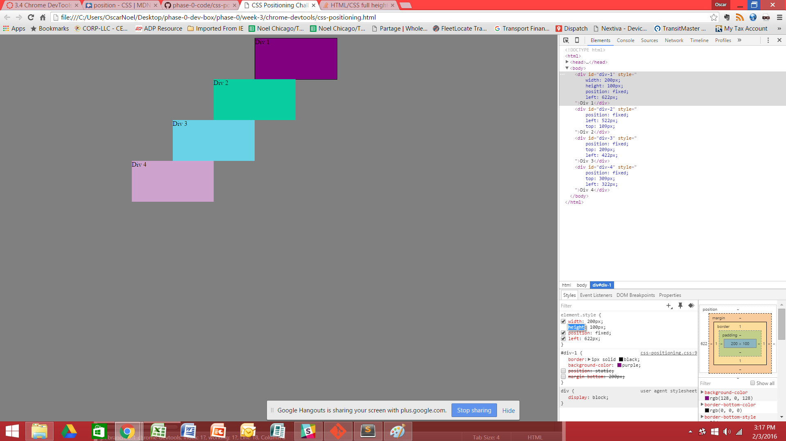

# 3.4 Chrome DevTools

## Release 3 Exercises

### 1.

### 2.

### 3.

### 4.

### 5.

### 6.

### 7.

### 8.

### 9.

* How can you use Chrome's DevTools inspector to help you format or position elements?
* How can you resize elements on the DOM using CSS?
* What are the differences between absolute, fixed, static, and relative positioning? Which did you find easiest to use? Which was most difficult?
* What are the differences between margin, border, and padding?
* What was your impression of this challenge overall? (love, hate, and why?)

Chrome's DevTools inspector is great for testing out the layout of the website in real-time. Being able to actively change the css code directly while viewing the page, gives a whole new level of insight. Also, by preserving the original css file, I can really experiment all I want and if I don't like the results I can just refresh the page. This gives me a level of comfort knowing that I can instantly see the results and adjust accordingly.

There are different ways to resize elements in CSS. The most direct of methods is by specifying a width and height in a measurement (pixels, em, etc.).Another way is to specify a percentage of the width and/or height of the element in relation to its containing block (always defaulting to the body if there is no containing block). Finally the size of an element can be affected by margins, padding, and borders. If any of these attributes are specified, the element will then protrude or shrink depending on their values.

Just as there are different ways to resize elements in CSS, there are also many different ways of positioning them on your website. For a block element to be positioned, they need to have the position property explicitly stated.

    .block-1 {
    	position: static;
    }