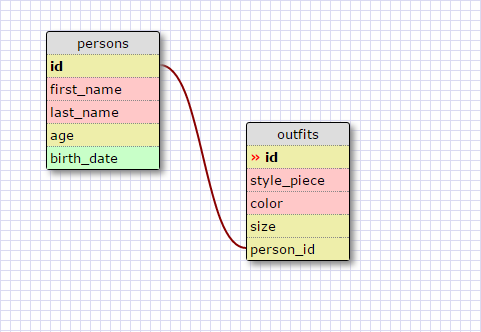

# 8.4 Introduction to Database Schemas and SQL

## Release 5

Commands used in exercises:

1. SELECT * FROM states;
2. SELECT * FROM regions;
3. SELECT state_name, population FROM states;
4. SELECT state_name, population FROM states ORDER BY population DESC;
5. SELECT state_name FROM states WHERE region_id=7;
6. SELECT state_name, population_density FROM states WHERE population_density>50 ORDER BY population_density ASC;
7. SELECT state_name FROM states WHERE population BETWEEN 1000000 AND 1500000;
8. SELECT state_name, region_id FROM states ORDER BY region_id;
9. SELECT region_name FROM regions WHERE region_name LIKE '%Central%';
10. SELECT region_name, state_name FROM regions, states WHERE region_id = regions.id

## Release 6

## Release 7

* What are databases for?

Databases are used to hold vast amounts of information in a key-value form. They help maintain data in tables that can then be related in some aspects. For example, a table with users can hold people's information including an identifier that relates to another table with regions that users can be a part of.

* What is a one-to-many relationship?

A one-to-many relationship is a type of relation between data tables, this indicates that one item in one table can belong to many items or rows in a seperate table. For example, a table containing tables can contain teacher personal information or contact information, each teacher being assigned a unique number. Meanwhile, in a childrens table containing information for children including a field or column with a number that corresponds to the teacher's unique id. In this way many children can have the same one teacher if they all have the same unique id belonging to the teacher in the teachers table.

* What is a primary key? What is a foreign key? How can you determine which is which?

A primary key is a unique identifier in a table for each row, in can be, for example a number that increments which each added item, or it can be a word. A foreign key is a key in another table that relates to possibly the primary key of another table. It is foreign in the sense that it refers to an external table.

* How can you select information out of a SQL database? What are some general guidelines for that?

You can select information from a database using SQL commands. SELECT initiates the statement, this is followed by the column names you want shown followed by the word FROM which is used to select the table, and optionally you can use WHERE to start a conditional statement  or ORDER BY to sort the information.