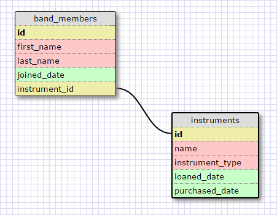
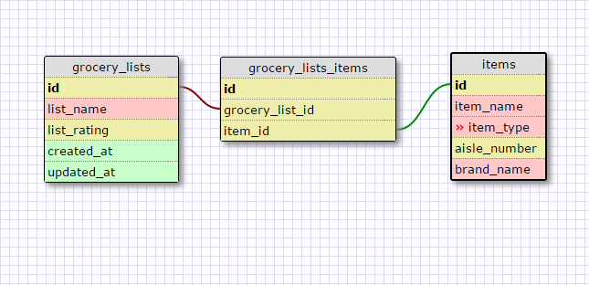

## 8.5 More Schemas

## Release 2 One-to-One Relationship

My example is a one-to-one relationship because only one instrument can belong to band member, especially if the band has specific amount of spots and a specific amount of instruments to lend out.

## Release 4

## Release 6

* What is a one-to-one database?

A one-to-one database, is a database with tables that share only one row.

* When would you use a one-to-one database? (Think generally, not in terms of the example you created).

A one-to-one database is useful when one table can't contain all of the columns for a particular data set, or when part of the data isn't necessary unless it's called. So for example, you can have users, or drivers, or students, with their personal information but you can expand one of the columns for related items, such as users with one bio description, driver with one tractor or trailer, and students with an instrument that has been loaned. In these cases, you could add the information to the first table, but that would take more time to load, or more information than needed would be cached.

* What is a many-to-many database?

A many-to-many database represents a data structure where on data type might contain multiple associations with a different data structure and vice versa.

* When would you use a many-to-many database? (Think generally, not in terms of the example you created).

You would require a many-to-many database when one table can have different rows with the same column value from another, and that table similarly can have the same value in multiple rows in a column.

* What is confusing about database schemas? What makes sense?

The most confusing part is deciding which relationship to use, sometimes it is not as obvious and it appears that different variations are possible. I'm sure this is the design and maximizing efficiency aspect of database creation. So far, one-to-one and many-to-many relationships are not that difficult to understand. At least for now I have a clear picture of when to use which one, although adding more complexity will probably make more things difficult.